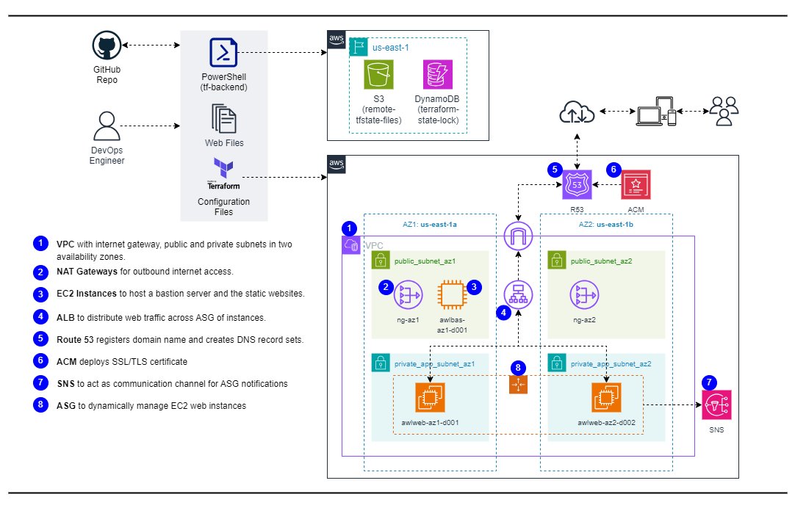

# Deploying Static Website on AWS (VPC, EC2, ALB, R53, ACM, ASG) using Terraform

## Overview:
This project demonstrates how to deploy a static website on Amazon Web Services (AWS) using Terraform. The setup includes various AWS services such as VPC, EC2, ALB, Route 53, ACM, ASG, and more to ensure high availability, scalability, and fault tolerance of the website.

## Reference Diagram:

## Project Components:
1. **VPC**: Virtual Private Cloud with internet gateway, public and private subnets across two availability zones (AZs) for fault tolerance.
2. **NAT Gateways**: Two NAT gateways, one per public subnet, with elastic IPs for outbound internet access from private subnets.
3. **Security Groups**: For SSH access, load balancer, and application servers.
4. **EC2 Instances**: Hosts the static website.
5. **Application Load Balancer (ALB)**: Distributes web traffic across auto scaling group of EC2 instances in two AZs. Configured for HTTPS traffic with HTTP to HTTPS redirection.
6. **Route 53**: Registers domain name and creates DNS record sets.
7. **AWS Certificate Manager (ACM)**: Deploys SSL/TLS certificate for secure communication.
8. **SNS Topic**: Acts as a communication channel for notifications from Auto Scaling Group (ASG).
9. **Auto Scaling Group (ASG)**: Dynamically manages EC2 instances for high availability, scalability, fault tolerance, and elasticity.
10. **GitHub Repository**: Stores web files.

## Prerequisites

Before you begin, ensure you have the following:

- An AWS account with appropriate permissions.
- Terraform installed on your local machine.

## Notes
- Ensure that you have the necessary AWS credentials configured on your system for Terraform to authenticate with AWS.
- Review the Terraform configuration files to understand the resource provisioning process.
- Refer to the official Terraform documentation for more information on configuring AWS resources using Terraform.

## Deployment Steps:
1. **Clone Repository**: Clone the repository to your local machine.
2. **Configure Terraform**: Update necessary variables in the Terraform configuration files.
3. **Initialize Terraform**: Run `terraform init` to initialize the working directory.
4. **Create Resources**: Run `terraform apply` to create AWS resources.
5. **Test Website**: Access provided website URL to verify functionality of the static website.
6. **Cleanup**: After testing,  it's important to clean up resources to avoid unnecessary charges. Execute `terraform destroy` to remove all resources provisioned by Terraform.

## Resources:
- [Terraform Documentation](https://www.terraform.io/docs/index.html)
- [AWS Documentation](https://docs.aws.amazon.com/index.html)

## Additional Notes
- Customize Terraform scripts and configurations as needed for your specific requirements.
- Ensure proper IAM permissions and security measures are in place for managing AWS resources securely.
