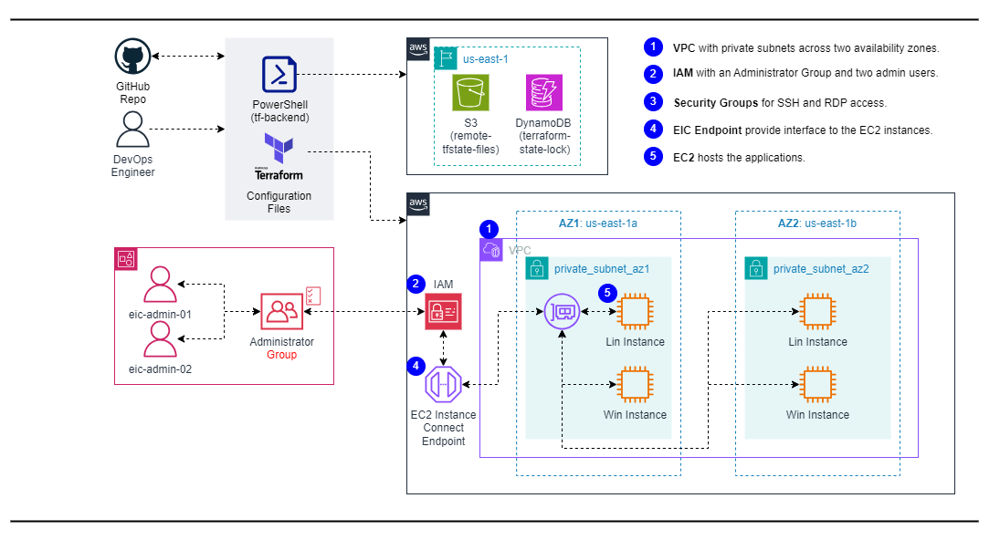

# Implement AWS EC2 Instance Connect Endpoint using Terraform

## Overview:
The EC2 Instance Connect (EIC) Endpoint is the interface through which users interact with the service to establish SSH connections to their EC2 instances. When an SSH connection request is made to this endpoint, EIC verifies the requester's IAM permissions and grants temporary access to the specified instance if authorized.

## Reference Diagram:


### Comparing EC2 Bastion Server and EC2 Instance Connect Endpoint

| **Feature** | **EC2 Bastion Server** | **EC2 Instance Connect** |
|-----------------------|--------------------|----------------------|
| Setup Complexity      | Requires manual setup                                            | Easy to set up                                              |
| Public IP Requirement | Requires a public IP                                             | No public IP required                                       |
| Security              | Requires additional security configurations and maintenance      | Enhanced security through private network paths             |
| Connection Method     | SSH via bastion host                                             | SSH directly to instances                                   |
| Network Access        | Accesses instances in private subnets via bastion host           | Directly connects to instances in private subnets           |
| Scalability           | Requires additional configuration for scaling and load balancing | Works well with auto-scaling and load-balanced environments |
| Cost                  | Incurs additional cost for maintaining a bastion server          | No additional cost for EC2 Instance Connect                 |
| Management            | Requires managing and maintaining a separate bastion server      | Simplified management and administration                    |

## Project Components:
- **VPC**: Virtual Private Cloud with private subnets across two availability zones.
- **IAM**: IAM with an Administrator Group and two admin users.
- **Security Group**: For SSH and RDP access.
- **EC2 Instance Connect Endpoint**: EIC provide interface endpoint to the EC2 instances.
- **EC2**: Hosts the application.

## Prerequisites:
- An AWS account with appropriate permissions.
- Terraform installed on your local machine.
- AWS CLI configured with access keys.

## Notes:
- Ensure that you have the necessary AWS credentials configured on your system for Terraform to authenticate with AWS.
- Review the Terraform configuration files to understand the resource provisioning process.

## Usage:
1. Clone Repository: Clone the repository to your local machine.
2. Navigate to the repository directory:
3. Initialize Terraform: Run terraform init to initialize the working directory.
4. Deploy the infrastructure: Run terraform apply to create AWS resources.
5. After the deployment is complete, connect to the EC2 instance using Instance Connect either through the AWS Management Console or using the AWS CLI command.
6. You should now have SSH access to the EC2 instance.
7. (Optional) To clean up the resources, run: terraform destroy.


## High-level Deployment Steps:
1. Create a VPC with public and private subnets.
2. Install the latest version of the AWS CLI on your computer.
3. Create an IAM policy that allows users to create, describe, and delete EC2 Instance Connect Endpoints.
4. Create an IAM policy that allows users to use the EC2 Instance Connect Endpoints.
5. Create an IAM user that has an access key and secret access key, and attach the policies to the user.

    ```
    Command: terraform output eic_endpoint_admin_01_secret_access_key
    Command: terraform output eic_endpoint_admin_02_secret_access_key
    ```

6. Run the "aws configure" command to configure the IAM user's credentials on your computer.
7. Verify that the OpenSSH client is installed on your computer.
    Command: ssh -V
8. Create security groups in your VPC.
    - eic-endpoint-sg: Open outbound traffic on port 22 and use the VPC CIDR for the source destination.
    - ec2-instance-sg: Open inbound traffic on port 22 and use the eic-endpoint-sg for the source destination.
9. Create the EC2 Instance Connect Endpoints.
10. Launch an EC2 instance in the private subnet in your VPC.
12. Connect to the instance via Bash

    **AWS CLI command**

    ```
    aws ec2-instance-connect ssh --instance-id [your-instance-id]  --region us-east-1 --profile eic-admin-01
    ```
    
    **Open-tunnel command**

    ```
    ssh -i ./key-pair/terraform-key.pem ec2-user@[your-instance-id]  -o ProxyCommand='aws ec2-instance-connect open-tunnel --instance-id [your-instance-id] %h'
    ```

    ```
    aws ec2-instance-connect open-tunnel --region us-east-1 --profile eic-admin-01 --instance-id [your-instance-id] --remote-port 3389 --local-port 65124 --max-tunnel-duration 3600
    ```

## Resources:
- [Terraform Documentation](https://www.terraform.io/docs/index.html)
- [AWS Documentation](https://docs.aws.amazon.com/index.html)

## Additional Notes:
- Customize Terraform scripts and configurations as needed for your specific requirements.
- Ensure proper IAM permissions and security measures are in place for managing AWS resources securely.


