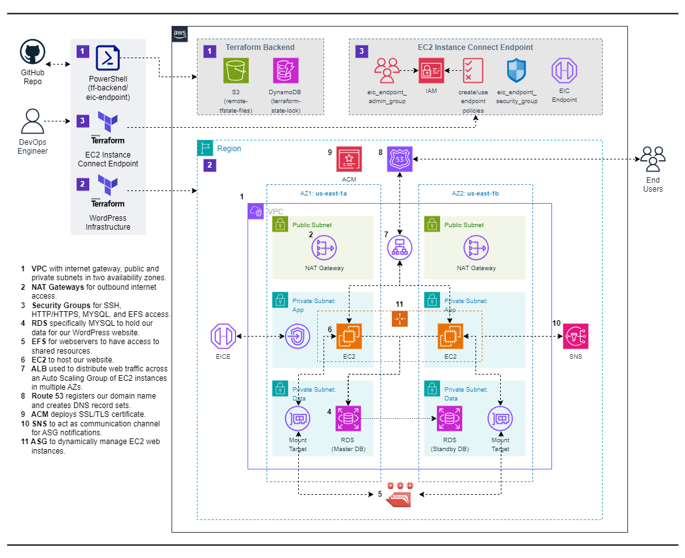

# Deploy a WordPress Website with Terraform

## Overview:
This project demonstrates how to deploy a WordPress website on Amazon Web Services (AWS) using Terraform. The setup includes core AWS services such as VPC, RDS, EFS, EC2, ALB, Route 53, ACM and ASG to ensure high availability, scalability, and fault tolerance of the website. 

## Reference Diagram:

## Project Components:
1. **VPC** with internet gateway, public and private subnets in two availability zones.
2. **NAT Gateways** for outbound internet access.
3. **Security Groups** for SSH, HTTP/HTTPS, MYSQL, and EFS access.
4. **RDS** specifically MYSQL to hold our data for our WordPress website.
5. **EFS** for webservers to have access to shared resources.
6. **EC2** to host our website.
7. **ALB** used to distribute web traffic across an Auto Scaling Group of EC2 instances in multiple AZs.
8. **Route 53** registers our domain name  and creates DNS record sets.
9. **ACM** deploys SSL/TLS certificate.
10. **SNS** to act as communication channel for ASG notifications.
11. **ASG** to dynamically manage EC2 web instances.

## Prerequisites:
Before you begin, ensure you have the following:
- An AWS account with appropriate permissions.
- Terraform installed on your local machine.

## Notes:
- Ensure that you have the necessary AWS credentials configured on your system for Terraform to authenticate with AWS.
- Review the Terraform configuration files to understand the resource provisioning process.
- Refer to the official Terraform documentation for more information on configuring AWS resources using Terraform.

## Deployment Steps:
1. Clone Repository: Clone the repository to your local machine.
2. Configure Terraform: Update necessary variables in the Terraform configuration files.
3. Initialize Terraform: Run terraform init to initialize the working directory.
4. Create Resources: Run terraform apply to create AWS resources.
5. Test Website: Access provided website URL to verify functionality of the static website.
6. Cleanup: After testing, it's important to clean up resources to avoid unnecessary charges. Execute terraform destroy to remove all resources provisioned by Terraform.

## Resources:
- [Terraform Documentation](https://www.terraform.io/docs/index.html)
- [AWS Documentation](https://docs.aws.amazon.com/index.html) 

## Additional Notes:
- Customize Terraform scripts and configurations as needed for your specific requirements.
- Ensure proper IAM permissions and security measures are in place for managing AWS resources securely.

This README provides a structured overview of the project, outlines the necessary components, prerequisites, and steps to deploy and manage the WordPress website using Terraform on AWS..
