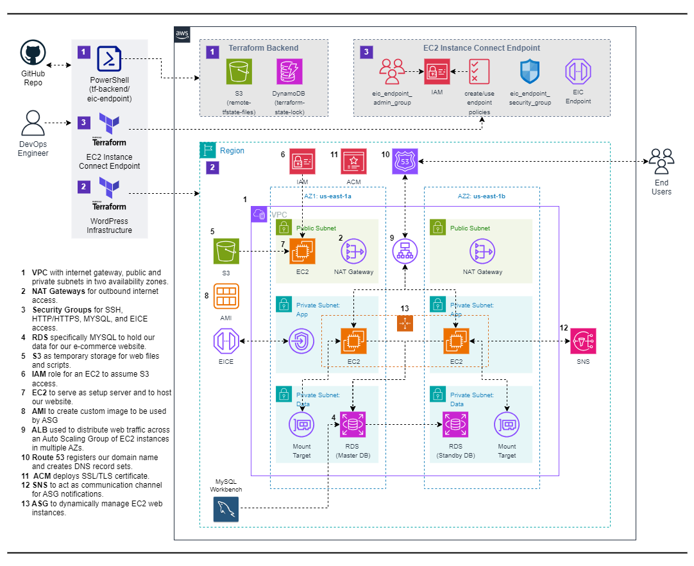

# Deploy a Dynamic Car Rental  Web App on AWS with Terraform

## Overview

This project demonstrates how to deploy a dynamic car rental website on Amazon Web Services (AWS) using Terraform. The setup includes VPC, RDS, S3, IAM, EC2, ALB, R53, ACM, and ASG.

## Reference Diagram

## Project Components

1. **VPC**: Virtual Private Cloud with an internet gateway, public and private subnets in two availability zones.
2. **NAT Gateways**: For outbound internet access.
3. **Security Groups**: For SSH, HTTP/HTTPS, MYSQL, and EC2 access.
4. **RDS**: Specifically MYSQL to hold our data for our e-commerce website.
5. **S3**: As temporary storage for web files and scripts.
6. **IAM**: Role for an EC2 to assume S3 access.
7. **EC2**: To serve as a setup server and to host our website.
8. **AMI**: To create a custom image to be used by ASG.
9. **ALB**: Application Load Balancer used to distribute web traffic across an Auto Scaling Group of EC2 instances in multiple AZs.
10. **Route 53**: Registers our domain name and creates DNS record sets.
11. **ACM**: Deploys SSL/TLS certificate.
12. **SNS**: Simple Notification Service to act as a communication channel for ASG notifications.
13. **ASG**: Auto Scaling Group to dynamically manage EC2 web instances.

## Prerequisites

Before you begin, ensure you have the following:

- An AWS account with appropriate permissions.
- Terraform installed on your local machine.

### Notes

- Ensure that you have the necessary AWS credentials configured on your system for Terraform to authenticate with AWS.
- Review the Terraform configuration files to understand the resource provisioning process.
- Refer to the official Terraform documentation for more information on configuring AWS resources using Terraform.

## Deployment Steps

1. **Clone Repository**: Clone the repository to your local machine.
2. **Configure Terraform**: Update necessary variables in the Terraform configuration files.
3. **Initialize Terraform**: Run `terraform init` to initialize the working directory.
4. **Create Resources**: Run `terraform apply` to create AWS resources.
5. **Test Website**: Access the provided website URL to verify the functionality of the website.
6. **Cleanup**: After testing, it's important to clean up resources to avoid unnecessary charges. Execute `terraform destroy` to remove all resources provisioned by Terraform.

## Resources

- [Terraform AWS Provider Documentation](https://registry.terraform.io/providers/hashicorp/aws/latest/docs)
- [AWS Documentation](https://docs.aws.amazon.com/)

## Additional Notes

- Customize Terraform scripts and configurations as needed for your specific requirements.
- Ensure proper IAM permissions and security measures are in place for managing AWS resources securely.

---

This README provides a structured overview of the project, outlines the necessary components, prerequisites, and steps to deploy and manage the e-commerce website using Terraform on AWS.
